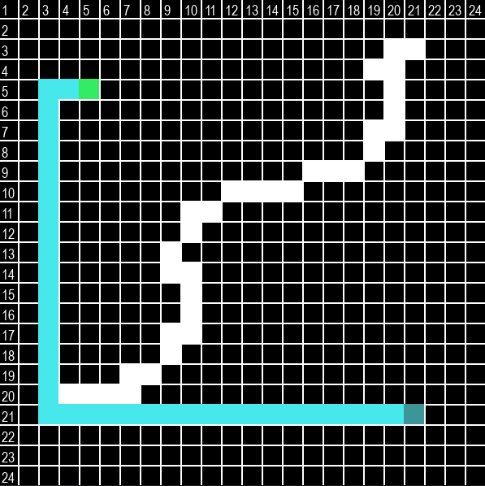

# Dijkstra's Algorithm Visualization in Python (Pygame)

  

## Overview

This project is a Python implementation of Dijkstra's algorithm for pathfinding, visualized using the Pygame library.

## Requirements

Install the required dependencies: `pip install -r requirements.txt`

Feel free to contribute.
